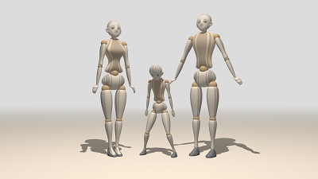

# Table of contents

- [About](#About)
- [Initialization](#Initialization)
- [Body parts](#Body-parts)
    * [Central body parts](#Central-body-parts)
    * [Upper limbs](#Upper-limbs)
    * [Lower limbs](#Lower-limbs)
- [Posture](#Posture)
    * [Static posture](#Static-posture)
    * [Dynamic posture](#Dynamic-posture)
- [Body modifications](#Body-modifications)
- [Miscallaneous](#Miscallaneous)

# About
**Mannequin.js** is a simple library of an articulated human figure. The shape of the figure
and its movements are done purely in JavaScript. The graphics is implemented in
[Three.js](threejs.org). Click on an image to open a live demo.

[](https://boytchev.github.io/mannequin.js/demos/demo-mannequin-01.html)
[](https://boytchev.github.io/mannequin.js/demos/demo-mannequin-02.html)
[](https://boytchev.github.io/mannequin.js/demos/demo-mannequin-03.html)
[](https://boytchev.github.io/mannequin.js/demos/demo-mannequin-04.html)
[](https://boytchev.github.io/mannequin.js/demos/demo-mannequin-05.html)

This is the fourth incarnation of the human figure. The first one was implemented
in Elica. The second one was implemented in C/C++ and OpenGL. The third one
was implemented in JS/Three.js and is a direct predecessor of the current mannequin.js.
Since its first incarnation, mannequin.js is used in the course *Fundamentals of Computer Graphics*
for Computer Sciences undergraduate students from the
[Faculty of Mathematics and Informatics](https://www.fmi.uni-sofia.bg/en)
at [Sofia University](https://www.uni-sofia.bg/index.php/eng).

Mannequin.js has GPL-3.0 License.


# Initialization

The **mannequin.js** library is provided as a JavaScript file that has to
be include along with three.js. Human figures are created as instances of classes, e.g. `new Male()`, `new Female()` or `new Child()`.

Here is a minimal program that creates a male figure in the browser ([demo](https://boytchev.github.io/mannequin.js/docs/example-minimal.html)):

``` xml
<!DOCTYPE html>
<html>
  <head>
    <script src="three.min.js"></script>
    <script src="mannequin.min.js"></script>
  </head>
  <body>
    <script>
      createScene();
      var man = new Male();
    </script>
  </body>
</html>
```

The helper function `createScene()` provides a default set-up of the scene and its elements, like lighting, camera, ground, etc. Another helper function, `animate(t)` is responsible for defining figures' postures at moment *t*. If the set-up is done with a custom function, then it should also manage the animation loop by itself.


# Body parts

All types of figures have the same structure of joints. For example, the right arm of a figure is accessed by `r_arm`. Left and right body parts are in respect to the figure, not to the viewer.


Each body part has rotation methods that turn it around a pivot point.
The first parameter *angle* of the methods is the angle of rotation in degrees,
so 180 is half turn and 360 is full turn. Negative angles are allowed and
they represent turning in the opposite direction. Some methods have an optional
second parameter for *direction* of motion, which could be the constant `LEFT` or
`RIGHT`.

### Central body parts

The central body parts are the ones which have single instances - *head*, *neck*, *torso*, *pelvis* and the body as a whole. The move the whole **body** use methods *bend*, *turn* and *tilt* of the figure ([demo](https://boytchev.github.io/mannequin.js/docs/example-body.html)):

* `figure.bend ( angle )`
* `figure.turn ( angle )`
* `figure.turn ( angle, direction )`
* `figure.tilt ( angle )`
* `figure.tilt ( angle, direction )`


The **head** supports similar methods: *nod*, *turn* and *tilt* ([demo](https://boytchev.github.io/mannequin.js/docs/example-head.html)):

* `figure.head.nod ( angle )`
* `figure.head.turn ( angle )`
* `figure.head.turn ( angle, dir )`
* `figure.head.tilt ( angle )`
* `figure.head.tilt ( angle, dir )`

The **torso** has the same methods as the whole body: *bend*, *turn* and *tilt* ([demo](https://boytchev.github.io/mannequin.js/docs/example-torso.html)):

* `figure.torso.bend ( angle )`
* `figure.torso.turn ( angle )`
* `figure.torso.turn ( angle, direction )`
* `figure.torso.tilt ( angle )`
* `figure.torso.tilt ( angle, direction )`

Although the **neck** is a separate part of the body, it is not controlled individually. Instead, a part of the head motion is distributed over the neck. Similarily, the **pelvis** is not controlled individually. Instead, the whole body is controlled by bending, turning and tilting.


### Upper limbs

The upper limbs are symmetrical body parts: *arm*, *elbow*, *wrist* and *fingers*.

Both **arms** support methods *raise*, *straddle* and *turn* ([demo](https://boytchev.github.io/mannequin.js/docs/example-arm1.html)). The following list refers to the right arm, however, the same methods are available for the right hand:

* `figure.r_arm.raise ( angle )`
* `figure.r_arm.straddle ( angle )`
* `figure.r_arm.straddle ( angle, direction )`
* `figure.r_arm.turn ( angle )`
* `figure.r_arm.turn ( angle, direction )`

If the *direction* parameter is omitted, then the default motions of *straddle* and *turn* are symmetrical. For example, the left arm is straddled to the left, while the right arm is straddled to the right ([demo](https://boytchev.github.io/mannequin.js/docs/example-arm2.html)). 

The motion of the **elbow** is only *bend* ([demo](https://boytchev.github.io/mannequin.js/docs/example-elbow.html)). Negative values for *angle* result in unnatural elbow position.

* `figure.r_elbow.bend ( angle )`

The **wrists** have the same methods as the torso: *bend*, *turn* and *tilt* ([demo](https://boytchev.github.io/mannequin.js/docs/example-wrist.html)), but similar to the arms, the directions are symmetrical, if *direction* is not set:

* `figure.r_wrist.bend ( angle )`
* `figure.r_wrist.turn ( angle )`
* `figure.r_wrist.turn ( angle, direction )`
* `figure.r_wrist.tilt ( angle )`
* `figure.r_wrist.tilt ( angle, direction )`

The last body part of the upper limbs are the **fingers**. They can only *bend* ([demo](https://boytchev.github.io/mannequin.js/docs/example-fingers.html)), however, they are composed of two segments and the bending angle is distributed over both of them.

* `figure.r_fingers.bend ( angle )`


### Lower limbs

The lower limbs are symmetrical body parts: *leg*, *knee* and *ankle*.

Both **legs** support methods *raise*, *straddle* and *turn* ([demo](https://boytchev.github.io/mannequin.js/docs/example-leg.html)). Straddling and turning are symmetrical if *direciton* is not set.

* `figure.r_leg.raise ( angle )`
* `figure.r_leg.straddle ( angle )`
* `figure.r_leg.straddle ( angle, direction )`
* `figure.r_leg.turn ( angle )`
* `figure.r_leg.turn ( angle, direction )`

The motion of the **knee** is only *bend* ([demo](https://boytchev.github.io/mannequin.js/docs/example-knee.html)). Negative values for *angle* result in unnatural knee position.

* `figure.r_knee.bend ( angle )`

The **ankles** have the same methods as the wrists: *bend*, *turn* and *tilt* ([demo](https://boytchev.github.io/mannequin.js/docs/example-ankle.html)), but similar to the legs, the directions are symmetrical, if *direction* is not set:

* `figure.r_ankle.bend ( angle )`
* `figure.r_ankle.turn ( angle )`
* `figure.r_ankle.turn ( angle, direction )`
* `figure.r_ankle.tilt ( angle )`
* `figure.r_ankle.tilt ( angle, direction )`


# Posture

tbd

### Static posture

tbd

### Dynamic posture

tbd

# Body modifications

tbd

# Miscallaneous

tbd

November, 2020

