Този документ е наличен и на [български език](README-BG.md).

# Table of contents

- [About](#about)
- [Initialization](#initialization)
	* [Minimal program](#minimal-program)
	* [Figure types](#figure-types)
- [Body parts](#body-parts)
    * [Central body parts](#central-body-parts)
    * [Upper limbs](#upper-limbs)
    * [Lower limbs](#lower-limbs)
- [Body posture](#body-posture)
    * [Static posture](#static-posture)
    * [Dynamic posture](#dynamic-posture)
    * [Working with postures](#working-with-postures)
	* [Posture editor](#posture-editor)
- [Other functions](#other-functions)
	* [Custom colors](#custom-colors)
	* [Hiding body parts](#hiding-body-parts)
	* [Custom body parts](#custom-body-parts)
	* [Global position](#global-position)
	* [VR mode](#vr-mode) (under development)

# About
**Mannequin.js** is a simple library of an articulated mannequin figure. The shape of the figure
and its movements are done purely in JavaScript. The graphics is implemented in
[Three.js](https://threejs.org). Click on an image to open a live demo.

[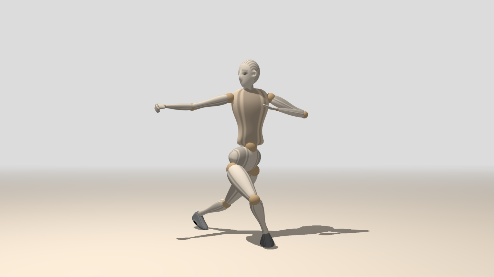](https://boytchev.github.io/mannequin.js/examples/example-posture.html)
[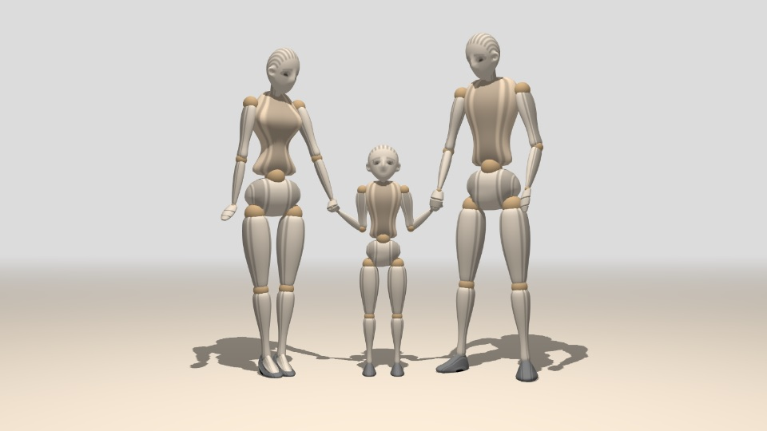](https://boytchev.github.io/mannequin.js/examples/example-figure-types.html)
[](https://boytchev.github.io/mannequin.js/examples/example-custom-body-parts.html)
[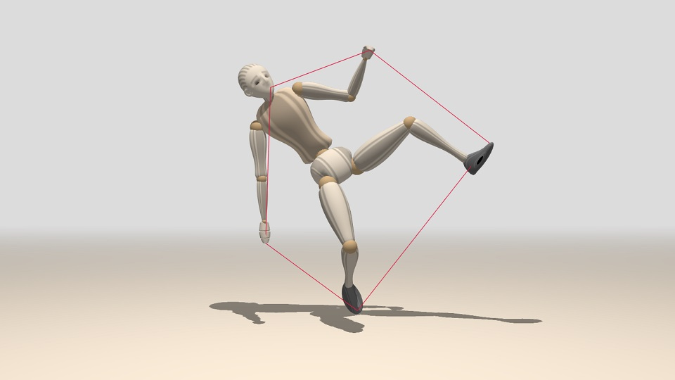](https://boytchev.github.io/mannequin.js/examples/example-point.html)
[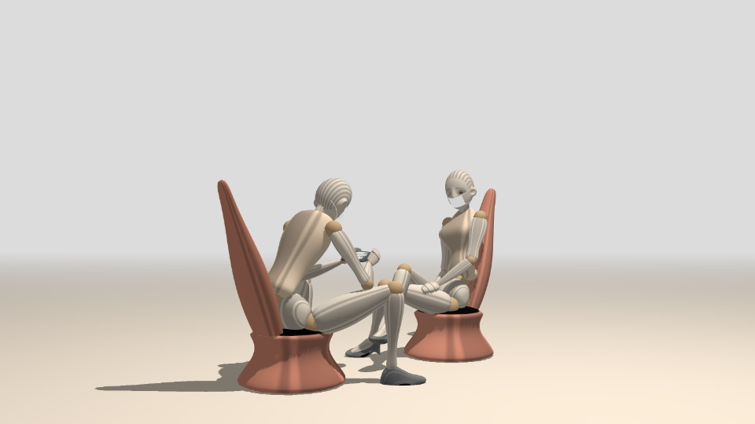](https://boytchev.github.io/mannequin.js/examples/example-scene.html)

You can try and build your own posturs with the online [Posture Editor](https://boytchev.github.io/mannequin.js/posture-editor.html)
[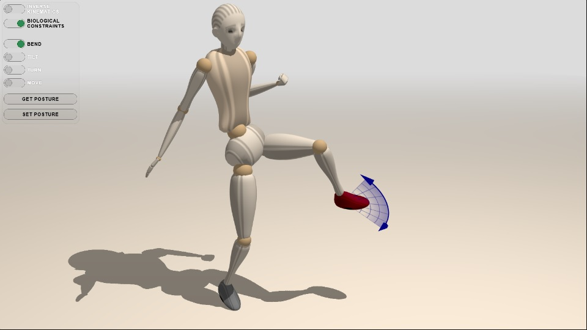](https://boytchev.github.io/mannequin.js/posture-editor.html)

This is the fourth incarnation of the mannequin figure library. The first one was implemented
in Elica. The second one was implemented in C/C++ and OpenGL. The third one
was implemented in JS/Three.js and is a direct predecessor of the current mannequin.js.
Since its first incarnation, mannequin.js is used in the course *Fundamentals of Computer Graphics* for Computer Sciences undergraduate students from the
[Faculty of Mathematics and Informatics](https://www.fmi.uni-sofia.bg/en)
at [Sofia University](https://www.uni-sofia.bg/index.php/eng).


Mannequin.js is licensed under **GPL-3.0**. Latest version is **4.41** from July 2021.

Three.js and OrbitControls.js are included in this repository to safeguard against incompatibilities with future versions. They are not a part of mannequin.js.


# Initialization

The **mannequin.js** library is provided as a single JavaScript file that has to
be include along with three.js or three.min.js. 

### Minimal program

Here is a minimal program that creates a male figure in the browser ([live example](https://boytchev.github.io/mannequin.js/examples/example-minimal.html)):

``` xml
<!DOCTYPE html>
<html>
   <body>
      <script src="../three.min.js"></script>
      <script src="../mannequin.js"></script>
      <script>
         createScene();
         man = new Male();
      </script>
   </body>
</html>
```

The helper function `createScene()` provides default scene, lighting, camera, ground, and so on. Another helper function, `animate(t)` is responsible for defining figures' postures at moment *t*. If the scene is created with a custom function, then it should also manage the animation loop by itself.

### Figure types

Mannequin figures are created as instances of classes `Male(height)`, `Female(height)` or `Child(height)`, wherethe optional *height* is the relative size of the figure. By default `Male` has height 1.00, `Female` has height 0.95 and `Child` has height 0.65 ([live example](https://boytchev.github.io/mannequin.js/examples/example-figure-types.html)):

[](https://boytchev.github.io/mannequin.js/examples/example-figure-types.html)

``` javascript
man = new Male();
man.position.x = 20;
man.turn = -120;
:
woman = new Female();
woman.position.x = -20;
woman.turn = -60;
:
kid = new Child();
kid.position.z = -7
:
```

These three classes have a common predecessor &ndash; the class `Mannequin(feminine,height)`, where the boolean paremeter *feminine* defines whether the shape is feminine or masculine
 ([live example](https://boytchev.github.io/mannequin.js/examples/example-height.html)):

[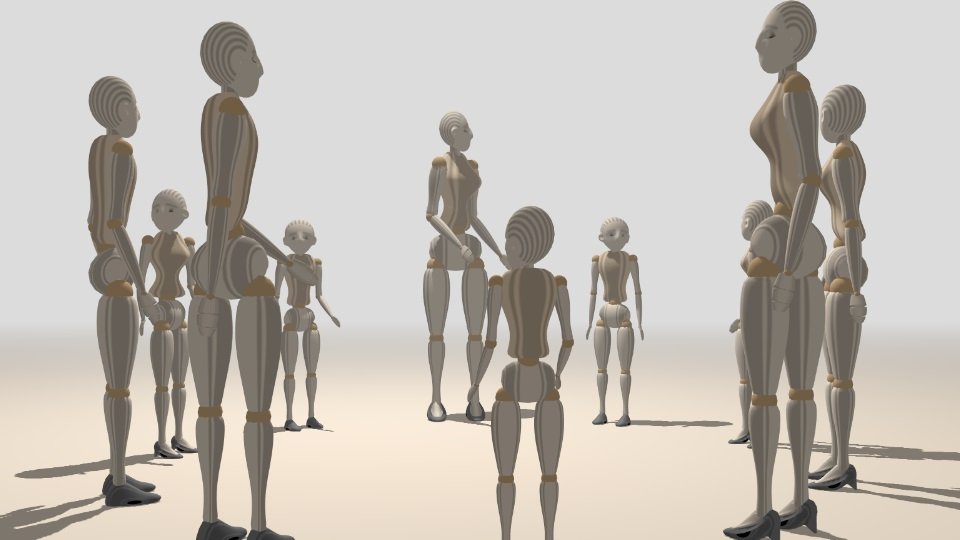](https://boytchev.github.io/mannequin.js/examples/example-height.html)

The difference between using different figure classes is that `Mannequin` sets a default neutral posture of the figure, while `Male` and `Female` set a default male and female posture.


# Body parts

All types of figures have the same structure. For example, the right arm of a figure is named `r_arm`. For some body parts mannequin.js uses the name of the joint &ndash; e.g. the left forearm is named `l_elbow`. Left and right body parts are always in respect to the figure, not to the viewer ([live example](https://boytchev.github.io/mannequin.js/examples/example-body-parts.html)):


[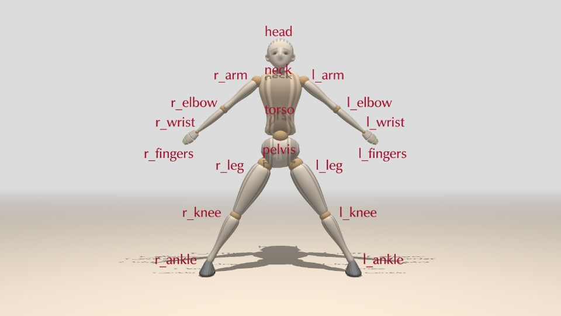](https://boytchev.github.io/mannequin.js/examples/example-body-parts.html)


Each body part has rotational properties that define its position. The values of the rotation properties are angles of rotation in degrees, so 180 is half turn and 360 is full turn. Negative angles are allowed and they represent rotations in the opposite directions. 

Mannequin.js has two ways of setting rotations &ndash; *absolute* and *relative*. When a rotation property is set to a specific value, this produces absolute rotation. The following code will set the forward bend angle of the torso to 45&deg;:

``` javascript
man.torso.bend = 45;
```

**Absolute rotations** are considered by some people as counterintuitive. Some joints, like wrists, have three rotational properties (*triplets*). Due to the nature of rotations in 3D space, rotations in a triplet are interconnected &ndash; modifying one property in a triplet often affects the other two. The following code demonstrates how seting the *turn* property modifies the *bend* property.

``` javascript
man.torso.bend = 45; /* bend=45 */
man.torso.turn = 45; /* turn=45, but now bend≈35.3 */
```


**Relative rotations** are set in respect to the current rotation value of the property. Modifications are much safer, as they do not rely on fixed values. The following code will bend the torso 45&deg; from its current position, and then turn it 45&deg;:

``` javascript
man.torso.bend += 45;
man.torso.turn += 45;
```

### Central body parts

The central body parts are the ones which have single instances &ndash; *head*, *neck*, *torso*, *pelvis* and the whole body as *body*. To rotate the **whole body** use properties `bend`, `turn` and `tilt` of the figure's `body` or the figure itself ([live example](https://boytchev.github.io/mannequin.js/examples/example-body.html)):

``` javascript
figure.body.bend = angle;
figure.body.turn = angle;
figure.body.tilt = angle;

figure.bend = angle;
figure.turn = angle;
figure.tilt = angle;
```


The **head** supports properties `nod`, `turn` and `tilt` ([live example](https://boytchev.github.io/mannequin.js/examples/example-head.html)):

``` javascript
figure.head.nod = angle;
figure.head.turn = angle;
figure.head.tilt = angle;
```

The **torso** has properties `bend`, `turn` and `tilt` ([live example](https://boytchev.github.io/mannequin.js/examples/example-torso.html)):

``` javascript
figure.torso.bend = angle;
figure.torso.turn = angle;
figure.torso.tilt = angle;
```

Although the **neck** is a separate part of the body, it is not controlled individually. Instead, half of the head rotation is distributed over the neck. Similarly, the **pelvis** is not controlled individually. Instead, the whole body is controlled by bending, turning and tilting.


### Upper limbs

The upper limbs are symmetrical body parts: *arm*, *elbow*, *wrist*, *fingers* and *finger tips*.

Both **arms**, `l_arm` and `r_arm`, support properties `raise`, `straddle` and `turn` ([live example](https://boytchev.github.io/mannequin.js/examples/example-arm.html)). The following list refers to the right arm, however, the same properties are available for the left arm:

``` javascript
figure.r_arm.raise = angle;
figure.r_arm.straddle = angle;
figure.r_arm.turn = angle;
```

Genrally, rotations of symmetrical body parts retain symmetry. For example, setting `straddle` to a positive relative angle straddles the left arm to the left, but the right arm &ndash; to the right.

The motion of the **elbow** is only `bend` ([live example](https://boytchev.github.io/mannequin.js/examples/example-elbow.html)). Negative values for *angle* result in unnatural elbow position.

``` javascript
figure.r_elbow.bend = angle;
```

The **wrists** have the same properties as the torso: `bend`, `turn` and `tilt` ([live example](https://boytchev.github.io/mannequin.js/examples/example-wrist.html)), but similar to the arms, rotations are symmetrical:

``` javascript
figure.r_wrist.bend = angle;
figure.r_wrist.turn = angle;
figure.r_wrist.tilt = angle;
```

The last body parts of the upper limbs are the **fingers** and their **tips**. They can only *bend*. Bending of fingers is automatically distributed to bending of their tips, so use `l_fingers` and `r_fingers` to bend fingers and tips ([live example](https://boytchev.github.io/mannequin.js/examples/example-fingers.html)), but `l_fingers.tips` and `r_fingers.tips` to bend tips only ([live example](https://boytchev.github.io/mannequin.js/examples/example-fingers-tips.html)):

``` javascript
figure.r_fingers.bend = angle;
figure.r_fingers.tips.bend = angle;
```


### Lower limbs

The lower limbs are symmetrical body parts: *leg*, *knee* and *ankle*.

Both **legs** support properties `raise`, `straddle` and `turn` ([live example](https://boytchev.github.io/mannequin.js/examples/example-leg.html)). Straddling and turning are symmetrical.

``` javascript
figure.r_leg.raise = angle;
figure.r_leg.straddle = angle;
figure.r_leg.turn = angle;
```

The motion of the **knee** is only `bend` ([live example](https://boytchev.github.io/mannequin.js/examples/example-knee.html)). Negative values for *angle* result in unnatural knee position.

``` javascript
figure.r_knee.bend = angle;
```

The **ankles** have the same properties as the wrists: `bend`, `turn` and `tilt` ([live example](https://boytchev.github.io/mannequin.js/examples/example-ankle.html)):

``` javascript
figure.r_ankle.bend = angle;
figure.r_ankle.turn = angle;
figure.r_ankle.tilt = angle;
```


# Body posture

The posture of a figure is defined by a setting the rotation properties of body parts. The order of rotations is important, i.e. changing the order of rotations produce different result. The next example applies bending 45&deg;, turning 90&deg; and tilting 60&deg; of three figures. As the order of rotations is different for each figure, the final position is also different ([live example](https://boytchev.github.io/mannequin.js/examples/example-order.html)):

``` javascript
man.torso.bend += 45;
man.torso.turn += 90;
man.torso.tilt += 60;

child.torso.tilt += 60;
child.torso.bend += 45;
child.torso.turn += 90;

woman.torso.turn += 90;
woman.torso.bend += 45;
woman.torso.tilt += 60;
```

### Static posture

The static posture defines the position of body part that do not change. By default, when a figure is created, its body parts are set to the default posture. If the posture editor is not used, all rotations has to be defined programmatically ([live example](https://boytchev.github.io/mannequin.js/examples/example-posture.html)):

[](https://boytchev.github.io/mannequin.js/examples/example-posture.html)

Sometimes it is better to define the figure step by step. Tai Chi Chuan posture, shown above, could start by defining the whole body position:

``` javascript
// overall body position
man.position.y -= 11;
man.body.tilt = -5;
:
// torso and head
man.torso.turn -= 30;
man.head.turn -= 70;:
```

Then the orientation of the legs can be set:

``` javascript
// right leg
man.r_leg.turn = 50;
man.r_knee.bend = 90;
man.r_ankle.bend = 15;
:
// left leg
man.l_leg.raise = -20;
man.l_knee.bend = 30;
man.l_ankle.bend = 42;
:
```

Finally, the arms are fixed:
	
``` javascript
// left arm
man.l_arm.straddle = 70;
man.l_elbow.bend = 155;
man.l_wrist.bend = -20;
:
// right arm
man.r_arm.straddle += 70;
man.r_elbow.bend += 40;
man.r_wrist.turn -= 60;
:
```
	
### Dynamic posture

The dynamic posture &ndash; i.e. a posture that changes over time &ndash; is set with the same properties that are used for static posture. Mannequin.js defines an empty function `animate(t)`, which is called in the animation loop once for each frame. All changes of a posture should be defined inside this function ([live example](https://boytchev.github.io/mannequin.js/examples/example-dynamic.html)). The parameter *t* is the time, measured in tenths of seconds. This function is set up in `createScene()`. If `createScene` and `animate` are not used, then the animation loop should be managed manually.

[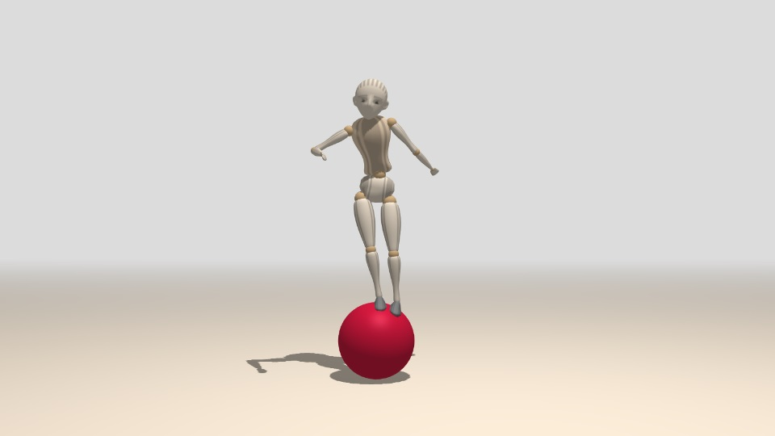](https://boytchev.github.io/mannequin.js/examples/example-dynamic.html)

``` javascript
function animate(t)
{
    var time1 = (sin(2*t)+cos(3*t)+cos(5*t))/3,
        time2 = (sin(2*t-60)+cos(3*t-90)+cos(5*t-120))/3;
	
    ball.position.x = -3*time1;
	
    child.position.x = -3*time1;
    child.position.y = 4.2+cos(90*time1);

    child.turn = -90-20*time1+20*time2;
    child.tilt = 10*time1;
    :
	
    scene.rotation.y = time1/2;
}
```

To make the animation loop faster, all constant rotations should be defined outside `animate`. Also, if a rotation is changing in the loop, there is no need to set it up outside the loop.
			
### Working with postures

A posture could be extracted from a figure with the `posture` property. It contains an object with fields `version` for the posture data format version, and `data` &ndash; a nested array for joint angles. The `posture` property can be used to push a posture to a figure. 

``` javascript
{ "version":5,
  "data": [ [90,-85,74.8], [16.1,-29.5,26.3], [3.5,-34.8,6.1],
            [14.1,-2.9,-19.8], [30], [-6,-6,-42.6], [14.6,-46.9,98.9],
			[90], [4.9,9,-15.4], [68.9,-34.7,-2.1], [155], [-20,0,0],
			[-10,-10], [-77,4.9,-1.1], [55], [15,-60,-20], [100,100]
		  ]
}
```

There is alternative `postureString` property to get or set the posture as a string. Converting the posture to and from a string is done with `JSON.stringify` and `JSON.parse`.


Postures could be blended via Euler interpolation (i.e. linear interpolation of Euler angels). The class method `blend(posture0,posture1,k)` mixes the initial *posture0* and the final *posture1* with a coefficient *k*&in;[0,1]. When *k*=0 the result is *posture0*, when *k*=1 the result is *posture1*, when *k* is between 0 and 1 the result is a posture between *posture0* and *posture1*.
The following example blends the posture of [one figure](https://boytchev.github.io/mannequin.js/examples/example-posture.html) and copies it to [another figure](https://boytchev.github.io/mannequin.js/examples/example-posture-standing.html) ([live example 1](https://boytchev.github.io/mannequin.js/examples/example-posture-blend.html) and [live example 2](https://boytchev.github.io/mannequin.js/examples/example-posture-blend-2.html)):

[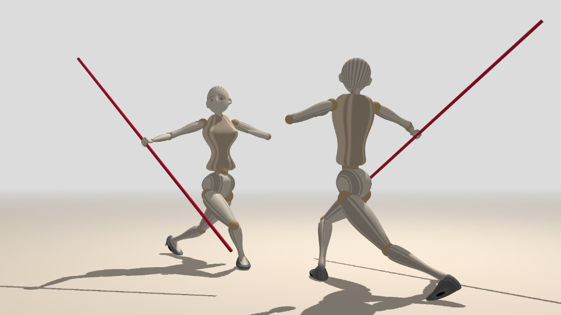](https://boytchev.github.io/mannequin.js/examples/example-posture-blend.html) [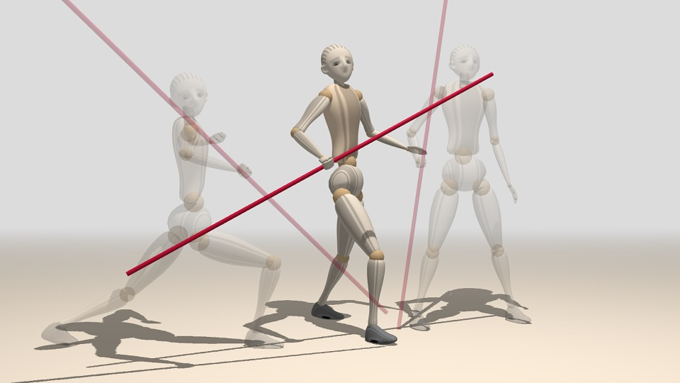](https://boytchev.github.io/mannequin.js/examples/example-posture-blend-2.html)

``` javascript
// two figures
man = new Male();
woman = new Female();

// two postures
A = {"version":5,"data":[[90,-85,74.8],...]};
B = {"version":5,"data":[[0,-90,0],...]};

// set an intermediate posture
man.posture = Mannequin.blend(A,B,0.5);

// copy the posture to another figure
woman.posture = man.posture;
```

### Posture editor

TBD


# Other functions

Apart for moving body parts, the current version of mannequin.js provides basic functionality for additional modification or accessing the figure.

### Custom colors

By default, all figures use a predefined set of global colors for body parts. Global colors are stored in `Mannequin.colors` array as six [Three.js colors](https://threejs.org/docs/#api/en/math/Color) or lowercase [HTML/CSS color names](https://www.w3schools.com/colors/colors_names.asp) in specific order &ndash; *head*, *shoes*, *pelvis*, *joints*, *limbs* and *torso*:

``` javascript
Mannequin.colors = [
    'antiquewhite',	// head
    'gray',		// shoes
    'antiquewhite',	// pelvis
    'burlywood',	// joints
    'antiquewhite',	// limbs
    'bisque'		// torso
];
```

The global color of joints and limbs refers to all joints and all limbs. Modification of the global colors in `Mannequin.colors` has effect if it is done before the creation of figure instances. Individual colors of body parts are set via the `recolor` method of each body part ([live example](https://boytchev.github.io/mannequin.js/examples/example-custom-colors.html)):

[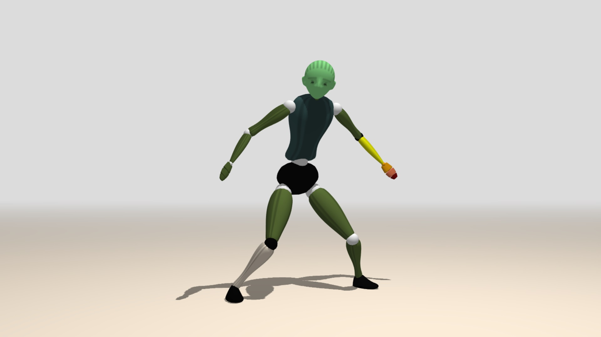](https://boytchev.github.io/mannequin.js/examples/example-custom-colors.html)

``` javascript
// global colors
Mannequin.colors = [ 'lightgreen', 'black', 'black', 'white', 'darkolivegreen', 'darkslategray'];

man = new Male();
:
// individual colors
man.l_elbow.recolor( 'yellow', 'black' );
man.l_wrist.recolor( 'orange' );
man.l_fingers.recolor( 'coral' );
man.l_fingers.tips.recolor( 'maroon' );
man.r_knee.recolor( 'antiquewhite', 'black' );
```

The first parameter of `recolor` is the color of the main section of the body part. The second parameter is the color of the spherical section (if present).

The tips of the fingers are accessed via `l_fingers.tips` and `r_fingers.tips`.


### Hiding body parts

Each body part could be hidden. This does not remove the body part and its graphical object from the figure, instead it is just not rendered in the frame. The method to hide a joint from a figure is:

``` javascript
figure.joint.hide();
```

where *joint* is the name of the body part to hide. Hidden body parts can still be rotated and this affects the other body parts attached to them. The following example hides both arms and both legs, but they are still preserved internally and used by elbows and knees ([live example](https://boytchev.github.io/mannequin.js/examples/example-hide.html)):

[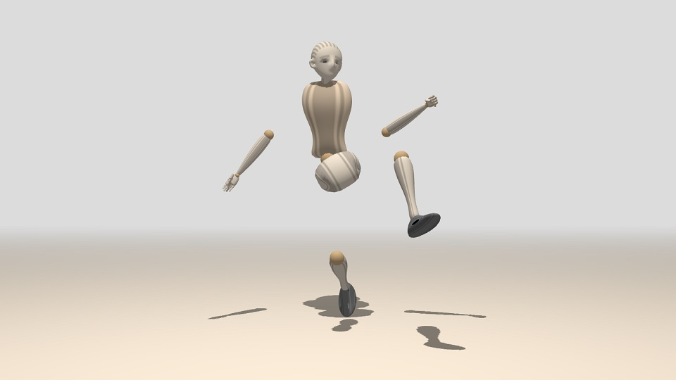](https://boytchev.github.io/mannequin.js/examples/example-hide.html)

``` javascript
man.l_leg.hide();
man.r_leg.hide();
man.l_arm.hide();
man.r_arm.hide();
```


### Custom body parts

Body parts are descendants of [`THREE.Object3D`](https://threejs.org/docs/#api/en/core/Object3D) and supports its properties and methods. However, due to the skeletal dependency and joint attachment, scaling of a body part should be congruent along all axes, otherwise positions need to be adjusted ([live example](https://boytchev.github.io/mannequin.js/examples/example-custom-sizes.html)):

[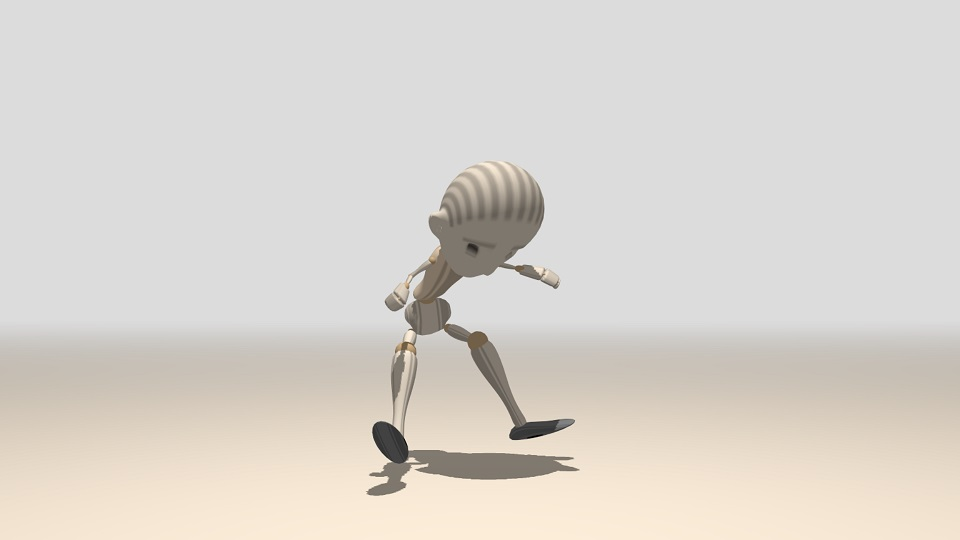](https://boytchev.github.io/mannequin.js/examples/example-custom-sizes.html)

``` javascript
man = new Male();

man.head.scale.set(3,3,3);

man.l_arm.scale.set(1/2,1/2,1/2);
man.r_arm.scale.set(1/2,1/2,1/2);

man.l_wrist.scale.set(3,5,3);
man.r_wrist.scale.set(3,5,3);
```

Any custom `THREE.Object3D` could be attached to a body part. The attached object is included in the body and is subject to any motion the body is doing:

``` javascript
figure.joint.attach(object);
```

Objects can be attached to hidden body parts, but they are not automatically hidden. This approach is used to replace a body part with entirely custom user object ([live example](https://boytchev.github.io/mannequin.js/examples/example-custom-body-parts.html)):

[](https://boytchev.github.io/mannequin.js/examples/example-custom-body-parts.html)

``` javascript
man = new Male();

// adding bracelets
bracelet = new THREE.Mesh(
    new THREE.CylinderGeometry(3,3,1,16),	
    new THREE.MeshPhongMaterial({color:'crimson',shininess:200})
);
bracelet.castShadow = true;
bracelet.position.y = 6;
man.l_elbow.attach(bracelet);

bracelet = bracelet.clone();
man.r_elbow.attach(bracelet);


// replacing the leg with other objects
man.r_leg.hide();

material = new THREE.MeshPhongMaterial({color:'crimson',shininess:200});

obj = new THREE.Mesh(new THREE.CylinderGeometry(3,2,3,32), material);
obj.castShadow = true;
obj.position.y = 2;
man.r_leg.attach(obj);
```

### Global position

Not all interaction between figures and other objects can be implemented by attaching. Mannequin.js provides method `point(x,y,z)` for each body part. This method implements [forward kinematics](https://en.wikipedia.org/wiki/Forward_kinematics) and calculates the global coordinates of the point *(x,y,z)*, defined in the local coordinate system of the body part.

The following example creates a thread going through 5 points relative to body parts of a figure ([live example](https://boytchev.github.io/mannequin.js/examples/example-point.html)):

[](https://boytchev.github.io/mannequin.js/examples/example-point.html)

``` javascript
setLoopVertex( 0, man.r_fingers.tips.point(0,1,0) );
setLoopVertex( 1, man.head.point(3,1.2,0) );
setLoopVertex( 2, man.l_fingers.tips.point(0,1,0) );
setLoopVertex( 3, man.l_ankle.point(6,2,0) );
setLoopVertex( 4, man.r_ankle.point(6,2,0) );
```

Global positions could be used to ground figures &ndash; this is to put them down on the ground. However, mannequin.js does not contain any collision functionality, thus the user should pick collision points and use their global position.

The following example uses four contact points on each shoe (i.e. `man.r_ankle` and `man.l_ankle`). The contacts points of the left show are shown as red dots. The minimal vertical position of the eight contact points is used to adjust the vertical position of the figure ([live example](https://boytchev.github.io/mannequin.js/examples/example-touch-ground.html)):

[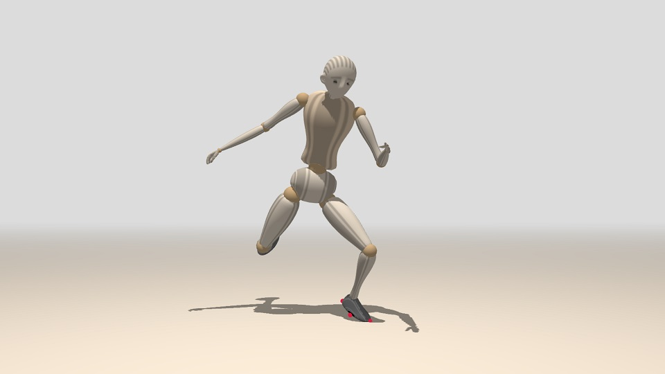](https://boytchev.github.io/mannequin.js/examples/example-touch-ground.html)

``` javascript
// get minimal vertical position of contact points
bottom = Math.min(
    man.l_ankle.point(6,2,0).y,
    man.l_ankle.point(-2,2.5,0).y,
    man.l_ankle.point(2,2.5,2).y,
    man.l_ankle.point(2,2.5,-2).y,

    man.r_ankle.point(6,2,0).y,
    man.r_ankle.point(-2,2.5,0).y,
    man.r_ankle.point(2,2.5,2).y,
    man.r_ankle.point(2,2.5,-2).y
);

man.position.y += (-29.5-bottom);
```			
				
### VR mode

VR mode is under development. 

---

July, 2021

