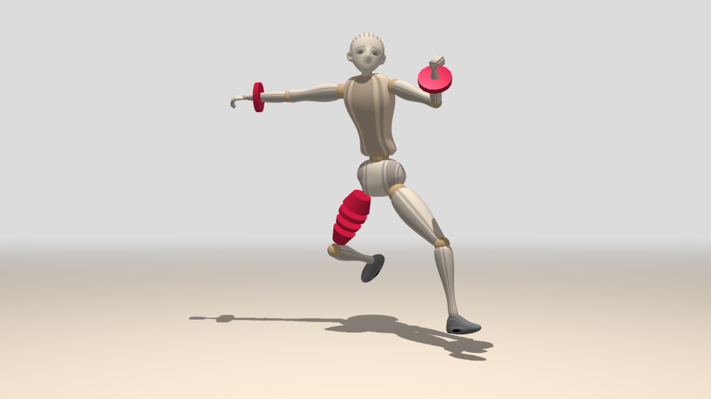
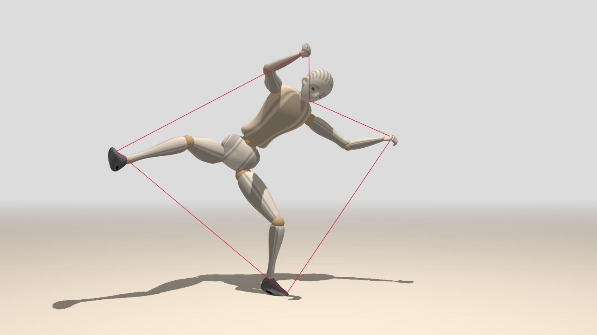
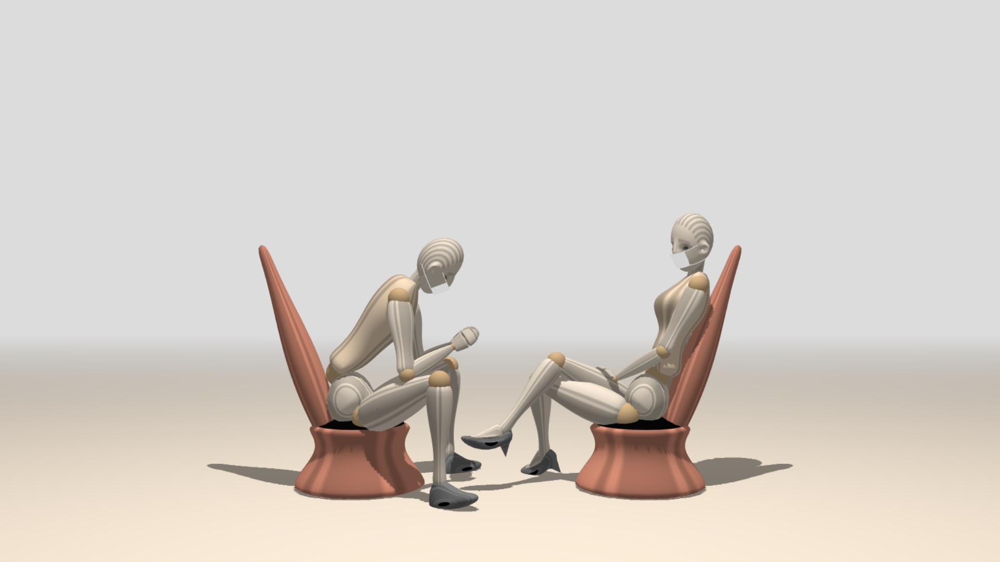

# mannequin.js
A simple library of a model of articulated human figure. The shape of the figure
and its movements are done purely in JavaScript. The graphics is implemented in
[Three.js](threejs.org).

The library is used int the course "Fundamentals of Computer Graphics" for Computer
Sciences undergraduate students from the [Faculty of Mathematics and Informatics](https://www.fmi.uni-sofia.bg/en)
at [Sofia University](https://www.uni-sofia.bg/index.php/eng).

This is the fourth incarnation of the human figure. The first one was implemented
in Elica. The second one was implemented in C/C++ and used OpenGL. The third one
was implemented in JS/Three.js.

# Source code

The main library is *mannequin.js*. It requires *three.min.js*, which is also
included in this repository. There is no need to compile anything. See the demos
for examples how to use the library.

# License

The source code of mannequin.js is made open as a form of software heritage.
The exact license is not decided yet, however, the code can be used/reused in
any type of non-commercial or educational project, provided there is proper 
acknowledgement.

# Demonstrations

### General position
A simple position with minimal motion &ndash; only the head is nodding.

### Types of figures
Example of how to create a male, a female and a child figure.

### Modifications
Demonstration how to attach Three.js objects to body parts or even how to
replace body parts with custom objects.

### Global position
Extracting global position of body parts in order to implement interaction
with other objects in the scene.

### Social scene
A more complex example of two figures sitting agains each other.

