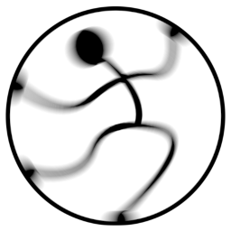


# Mannequin.js<br>Потребителска документация

## <small><small>This document is also available in [English](userguide.md)</small></small>

- **[Части на тялото](#части-на-тялото)** (<small>[Централни части на тяло](#централни-части-на-тяло) | [Горни крайници](#горни-крайници) | [Долни крайници](#долни-крайници)</small>)
- **[Поза на тялото](#поза-на-тялото)** (<small>[Статична поза](#статична-поза) | [Динамична поза](#динамична-поза) | [Работа с пози](#работа-с-пози)</small>)
- **[Други функционалности](#други-функционалности)** (<small>[Собствени цветове](#собствени-цветове) | [Модификация на тяло](#модификация-на-тяло) | [Позициониране](#глобална-позиция)</small>)
- **[Използване на Mannequin.js](#използване-на-mannequinjs)** (<small>[CDN](#пускане-от-cdn) | [локален уеб сървър](#пускане-през-локален-уеб-сървър) | [Nodes.js](#пускане-през-nodesjs) | [АПИ](#апи)</small>)


Mannequin.js е несложна библиптека за движение на фигури. Формата и движенията
им става през JavaScript. Ето кратък пример, който показва мъжка фигура
[пример на живо](example-minimal-cdn.html).

```html
<!DOCTYPE html>

<html>

<head>
   <script type="importmap">
   {
      "imports": {
         "three": "https://cdn.jsdelivr.net/npm/three@0.170.0/build/three.module.js",
         "three/addons/": "https://cdn.jsdelivr.net/npm/three@0.170.0/examples/jsm/",
         "mannequin": "https://cdn.jsdelivr.net/npm/mannequin-js@latest/src/mannequin.js"
      }
   }
   </script>
</head>

<body>
   <script type="module">
      import { createStage, Male } from "mannequin";
      createStage( );
      new Male();
   </script>
</body>
</html>
```


# Части на тялото

### Видове фигури

Фигурите в библиотеката се създават като инстанции на класовете `Male(height)`,
`Female(height)` или `Child(height)`, където незадължителният параметър *height*
е размер на височината е метри. По подразбиране `Male` има височина 1.80,
`Female` има височина 1.65 и `Child` има височина 1.15 ([пример на живо](example-figure-types.html)):

[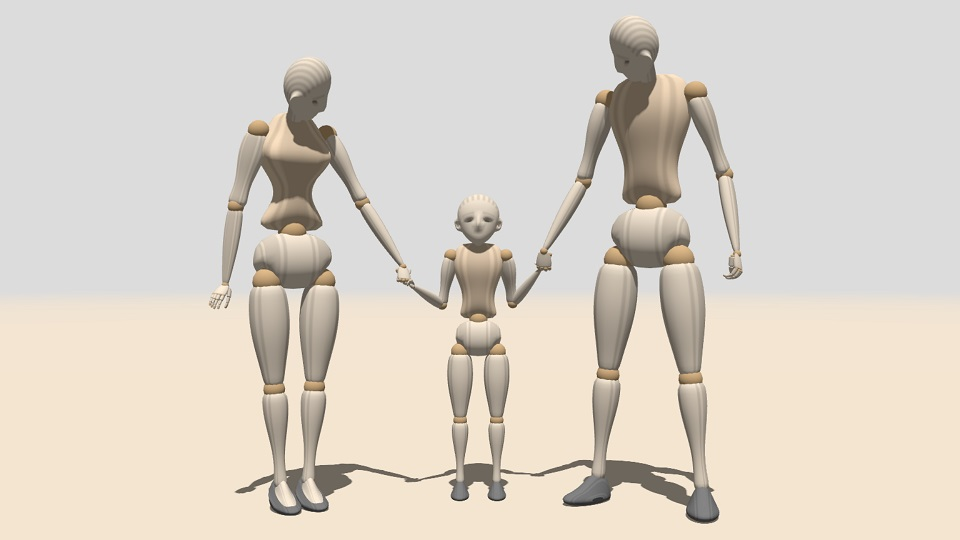](example-figure-types.html)

``` javascript
var man = new Male();
    man.position.x = 0.6;
    man.turn = -120;
:
var woman = new Female();
    woman.position.x = -0.65;
    woman.turn = -60;
:
var kid = new Child();
    kid.position.z = -0.18;
:
```

Тези три класа има общ родител &ndash; `Mannequin(feminine,height)`,
в който булевият параметър *feminine* определя дали формата е женствена
или мъжествена ([пример на живо](example-height.html)):

[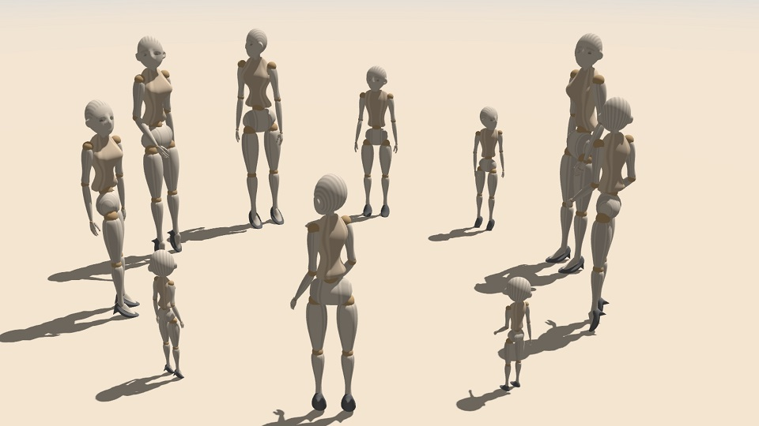](example-height.html)

Разликата между използването на различните класове за фигури е в това, че
`Mannequin` придава подразбираща се неутрална поза на фигурата, докато
`Male` и `Female` придават мъжествена и женствена поза.


Всички видове фигури имат една и съща структура. Например, дясната ръка
в кръстена `r_arm`. За някои части на тялото mannequin.js използва името
на ставата &ndash; напр. лявата предмишница е кръстена на лакъта `l_elbow`.
Левите и десните части на тялото са винаги спрямо фигурата, а не спрямо
потребителя ([пример на живо](example-body-parts.html)):


[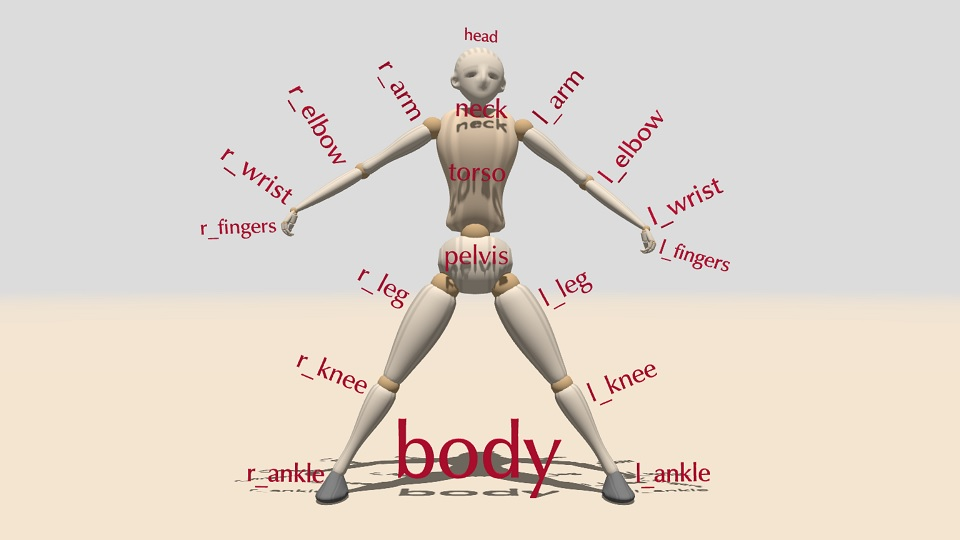](example-body-parts.html)


Всяка част от тялото има ротационни свойства, които определят нейната
позиция. Стойностите им са ъгли на завъртане в градуси, така че 180 е
завъртане на половин оборот, а 360 е пълен оборот. Отрицателни ъгли са
разрешени и представляват завъртане в противоположни посоки.

Mannequin.js има два начина за настройка на въртене &ndash; *абсолютно*
и *относително*. Когато свойството за ротация е зададено с конкретна
стойност, това създава абсолютно завъртане. Следващият код ще зададе ъгъла
на огъване напред на торса на 45&deg;: 

``` javascript
man.torso.bend = 45;
```

**Абсолютните ротации** се считат от някои хора за неинтуитивни. Някои
стави, като китките, имат ротации по три ъгъла. Поради естеството на
ротациите в 3D пространство, трите ротации са взаимосвързани &ndash;
промяната на една от тях често засяга другите две. Следващият код
демонстрира как променянето на свойството *turn* променя свойството *bend*. 

``` javascript
man.torso.bend = 45; // bend=45
man.torso.turn = 45; // turn=45, но вече bend≈35.3
```

**Относителните ротации** се задават по отношение на текущата стойност
на ротационно свойството. Модификациите са много по-безопасни, тъй като
не разчитат на фиксирани стойности. Следващият код ще наведе торса на 45&deg;
от текущата му позиция и след това го завърти на 45&deg;: 


``` javascript
man.torso.bend += 45;
man.torso.turn += 45;
```

### Централни части на тяло

Централните части на тялото са тези, които са единични  &ndash; 
глава *head*, врат *neck*, торс *torso*, таз *pelvis* и
цялото тяло като *body*. За да се завърти **цялото тяло** се
използват свойствата `bend`, `turn` и `tilt` на елемента `body`
на фигурата или самата фигура ([пример на живо](example-body.html)):

``` javascript
figure.body.bend = angle;
figure.body.turn = angle;
figure.body.tilt = angle;

figure.bend = angle;
figure.turn = angle;
figure.tilt = angle;
```


Главата **head** поддържа свойствата `nod`, `turn` and `tilt` ([пример на живо](example-head.html)):

``` javascript
figure.head.nod = angle;
figure.head.turn = angle;
figure.head.tilt = angle;
```

Торсът **torso** има свойства `bend`, `turn` и `tilt` ([пример на живо](example-torso.html)):

``` javascript
figure.torso.bend = angle;
figure.torso.turn = angle;
figure.torso.tilt = angle;
```

Въпреки че вратът **neck** е отделна част от тялото, тя не се контролира
индивидуално. Вместо това половината от въртенето на главата се разпределя
върху врата. По същия начин тазът **pelvis** не се контролира индивидуално.
Вместо това цялото тяло се контролира чрез навеждане, завъртане и накланяне. 


### Горни крайници

Горните крайници са симетрични части на тялото: ръка *arm*, лакът *elbow*,
китка *wrist*, пръсти *fingers* и индивидуални пръсти върхове на пръсти *finger_0* до *finger_4* с техните средни фаланги (*finger_0.mid* до *finger_4.mid*) и върхове (*finger_0.tip* до *finger_4.tip*).

И двете ръце **arms**, `l_arm` и `r_arm`, поддържат свойства `raise`,
`straddle` и `turn` ([пример на живо](example-arm.html)).
Следващият код показва свойствата на дясната ръка, но същите са
налични и за лявата ръка:

``` javascript
figure.r_arm.raise = angle;
figure.r_arm.straddle = angle;
figure.r_arm.turn = angle;
```

По принцип ротациите на симетричните части на тялото се стремят да
запазят симетрията. Например, положителни относителни стойности на
`straddle` завъртат лявата ръка наляво, а дясната &ndash; надясно.

Завъртането на лакътя **elbow** е само с `bend` ([пример на живо](example-elbow.html)).
Отрицателни стойности на *angle* водят до неестествена поза на лакътя.

``` javascript
figure.r_elbow.bend = angle;
```

Китките **wrists** имат същите свойства като торса: `bend`, `turn` 
и `tilt` ([пример на живо](example-wrist.html)),
но подобно на ръцете, ротациите са симетрични:

``` javascript
figure.r_wrist.bend = angle;
figure.r_wrist.turn = angle;
figure.r_wrist.tilt = angle;
```

Последните части на горните крайници са пръстите **fingers**.  Те са дефинирани като множества (`l_fingers` и `r_fingers`) от отделни пръсти (`l_finger_0` до `l_finger_4` и `r_finger_0` до `r_finger_0`).

Множествата могат само да се свиват с *bend*. Свиването на пръстите автоматично свива и техните средни фаланги и върхове, така че с `l_fingers`
и `r_fingers` могат да се свият целите пръсти ([пример на живо](example-fingers.html)):

``` javascript
figure.r_fingers.bend = angle;
```

Отделните пръсти са номерирани от **палец** (0) до **кутре** (4). Пръстите поддържат свойствата `bend`, `straddle` и `turn`. Средната фаланга на пръст е `mid`, а крайната фаланга, върхът на пръста, е `tip`. Свойствата `mid` и `tip` на пръст поддтржат само `bend` ([пример на живо](example-finger-bend.html) и [пример на живо](example-finger-straddle.html)).

``` javascript
figure.r_finger_1.straddle = alpha;
figure.r_finger_1.bend = beta1;
figure.r_finger_1.mid.bend = beta2;
figure.r_finger_1.tip.bend = beta3;
```

### Долни крайници

Долните крайници са симетрични части на тялото: крак *leg*, коляно *knee*
и глезен *ankle*.

И двата крака **legs** поддържат свойствата `raise`, `straddle` и `turn`
([пример на живо](example-leg.html)). Разкрачването `straddle` и завъртането `turn` са симетрични.

``` javascript
figure.r_leg.raise = angle;
figure.r_leg.straddle = angle;
figure.r_leg.turn = angle;
```

Движението на коляното **knee** е само `bend` ([пример на живо](example-knee.html)). 
Отрицателни стойности на *angle* водят до неестествена поза на коляното.

``` javascript
figure.r_knee.bend = angle;
```

Глезените **ankles** имат същите свойства като китките: `bend`, `turn`
и `tilt` ([пример на живо](example-ankle.html)):

``` javascript
figure.r_ankle.bend = angle;
figure.r_ankle.turn = angle;
figure.r_ankle.tilt = angle;
```


# Поза на тялото

Позата на фигурата се определя чрез задаване на стойности на ротационните
свойства на частите на тялото. Редът на завъртанията е важен, т.е. промяната
на реда на завъртане води до различен резултат. Следващият пример показва
навеждане на 45&deg;, завъртане на 90&deg; и накланяне встрани на 60&deg; на
три фигури. Тъй като редът на завъртане е различен за всяка фигура, крайните
им пози също са различни ([пример на живо](example-order.html)):

``` javascript
man.torso.bend += 45;
man.torso.turn += 90;
man.torso.tilt += 60;

child.torso.tilt += 60;
child.torso.bend += 45;
child.torso.turn += 90;

woman.torso.turn += 90;
woman.torso.bend += 45;
woman.torso.tilt += 60;
```

### Статична поза

Статичната поза определя позицията на част от
тялото, която не се променя. Когато се създава
фигура, частите на тялото ѝ заемат вградената
поза по подразбиране. Ако не се изолзва редактор
на поза, всички ротации трябва да бъдат дефинирани
програмно ([пример на живо](example-posture.html)):

[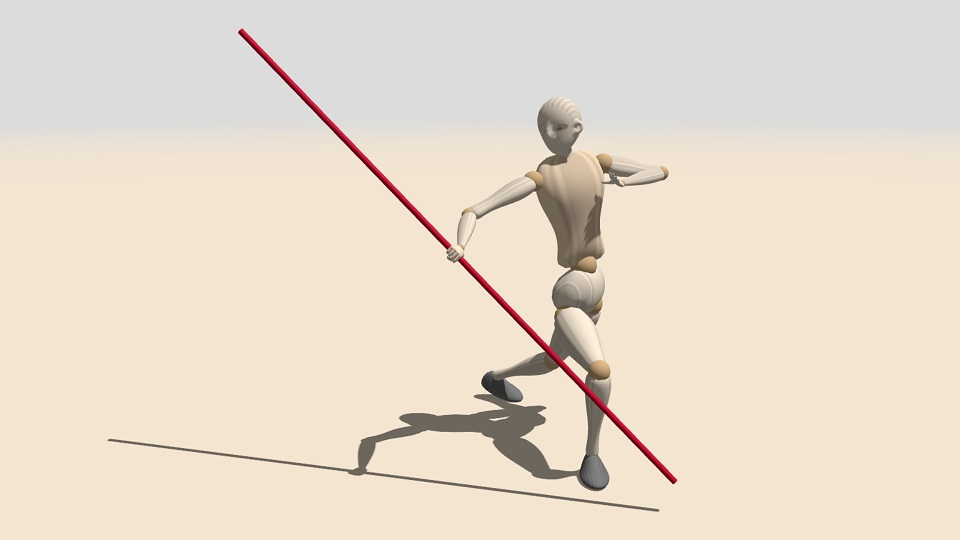](example-posture.html)

Понякога е по-добре да се дефинира фигура стъпка
по стъпка. Позата "Тай Чи Чуан", показана по-горе,
може да започне със задаване на позицията на цялото
тяло: 

``` javascript
// обща поза на тялото
man.body.tilt = -5;
man.body.bend = 15.2;
:
// торс и глава
man.torso.turn -= 30;
man.head.turn -= 70;:
```

След това може да се зададе ориентацията на краката:

``` javascript
// десен крак
man.r_leg.turn = 50;
man.r_knee.bend = 90;
man.r_ankle.bend = 15;
:
// ляв крак
man.l_leg.raise = -20;
man.l_knee.bend = 30;
man.l_ankle.bend = 42;
:
```

Накрая и ръцете се нагласяват:
	
``` javascript
// лява ръка
man.l_arm.straddle = 70;
man.l_elbow.bend = 155;
man.l_wrist.bend = -20;
:
// дясна ръка
man.r_arm.straddle += 70;
man.r_elbow.bend += 40;
man.r_wrist.turn -= 60;
:
```
	
### Динамична поза

Динамичната поза &ndash; т.е. поза, която се променя с времето &ndash; се задава
със същите свойства, които се използват за статична поза. Mannequin.js управлява
динамичните пози чрез потребителска функция за анимация. Тази потребителска функция
се извиква в цикъла на анимацията веднъж за всеки кадър. Всички промени в позата
трябва да бъдат дефинирани във функцията ([пример на живо](example-dynamic.html)).
Параметърът *t* е времето, измерено в секунди от стартирането на библиотеката.
Името на потребителската функция се подава като параметър на `createStage()`.

[](example-dynamic.html)

``` javascript
createStage( animate );

function animate(t)
{
    var time1 = Math.sin( 2*t ),
        time2 = Math.sin( 2*t-60 );
	
    ball.position.x = 0.06*time1;
	
    child.position.y = 0.31 + 0.05*Math.cos(time1 * Math.PI/2);

    child.turn = -90-20*time1+20*time2;
    child.tilt = 10*time1;
    :
}
```

За да се направи цикълът на анимацията по-бърз, всички
фиксирани ротации трябва да бъдат дефинирани извън
`animate`. 


### Работа с пози

Позата може да бъде извлечена от фигура чрез свойството `posture`. То съдържа
обект с елементи `version` за версията на формата на данните за позата и `data`
&ndash; вложен масив с ъглите на завъртане на ставите. Свойството `posture` може
да се използва и за задаване на поза на фигура.

``` javascript
{ "version": 7,
  "data": [ [0,0,0], [90,-85,74.8], [16.1,-29.5,26.3], [3.5,-34.8,6.1], ... ]
}
```

Има алтернативно свойство `postureString`, с което се извлича или задава поза
като текстов низ. Преобразуването на позата към и от текстов низ се прави с
`JSON.stringify` и `JSON.parse`.


Позите могат да бъдат сливани чрез ойлерова интерполация (т.е. линейна интерполация
на ойлерови ъгли). Функцията `blend(posture0,posture1,k)` слива 
първоначалната поза *posture0* и крайната поза *posture1* с коефициент
*k*&isin;[0,1]. Когато *k*=0 резултатът е поза *posture0*, когато *k*=1
резултатът е поза *posture1*, когато *k* е между 0 и 1 резултатът е междинна
поза между *posture0* и *posture1*.
Следващият пример слива позата на [една фигура](example-posture.html) и я копира в [друга фигура](example-posture-standing.html) ([пример на живо 1](example-posture-blend.html) и [пример на живо 2](example-posture-blend-2.html)):

[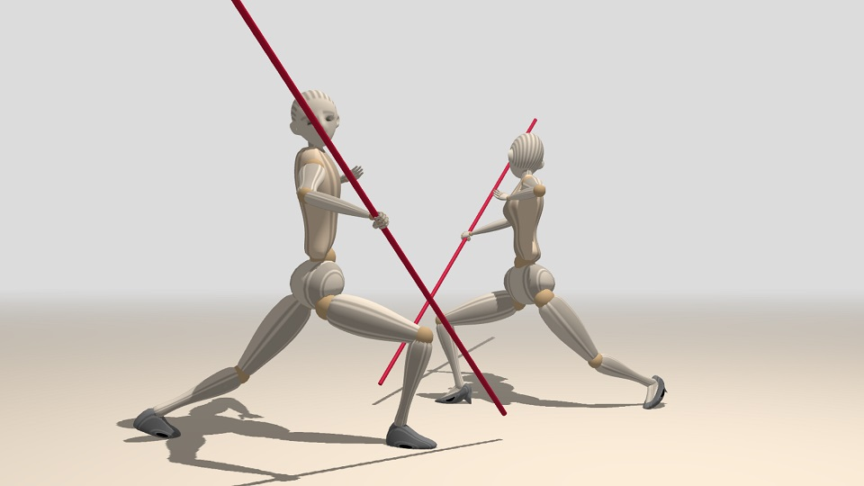](example-posture-blend.html) [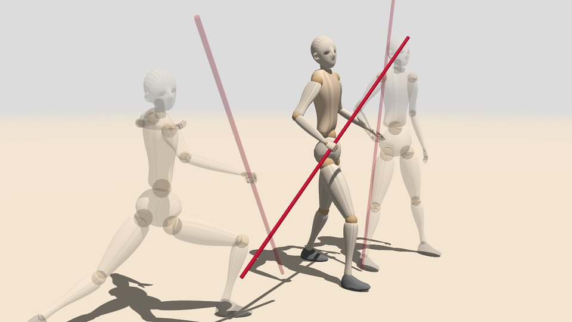](example-posture-blend-2.html)

``` javascript
// две фигури
var man = new Male();
var woman = new Female();

// две пози
var A = {"version": 7, "data": [[ 0, -7.2, 0 ],...]};
var B = {"version": 7, "data": [[ 0, 2.8, 0 ],...]};

// задаване на междинна поза
man.posture = blend(A,B,0.5);

// копиране на позата в друга фигура
woman.posture = man.posture;
```


# Други функционалности

Освен за движение на части на тялото, текущата версия на
mannequin.js предоставя основна функционалност за допълнителни
промени по фигурата.

### Собствени цветове

По подразбиране всички фигури използват предварително дефиниран набор от
 цветове за частите на тялото. Цветовете за конкретна фигура се задават с метода
 `recolor` със седем параметъра [Three.js цвята](https://threejs.org/docs/#api/en/math/Color)
или [HTML/CSS имена на цветове](https://www.w3schools.com/colors/colors_names.asp).
Тези цветове са за *глава*, *обувки*, *таз*, *стави*, *крайници*, *торс* и *нокти*:


``` javascript
man.recolor(
    'antiquewhite',	// глава
    'gray',		    // обувки
    'antiquewhite',	// таз
    'burlywood',	// стави
    'antiquewhite',	// крайници
    'bisque',		// тяло
	'burlywood'     // нокти
);
```

Цветът на ставите и крайниците се отнася до всички стави и всички крайници.
Цветовете на индивидуалните части от тялото могат да се променят чрез метода
`recolor` на частите ([пример на живо](example-custom-colors.html)):

[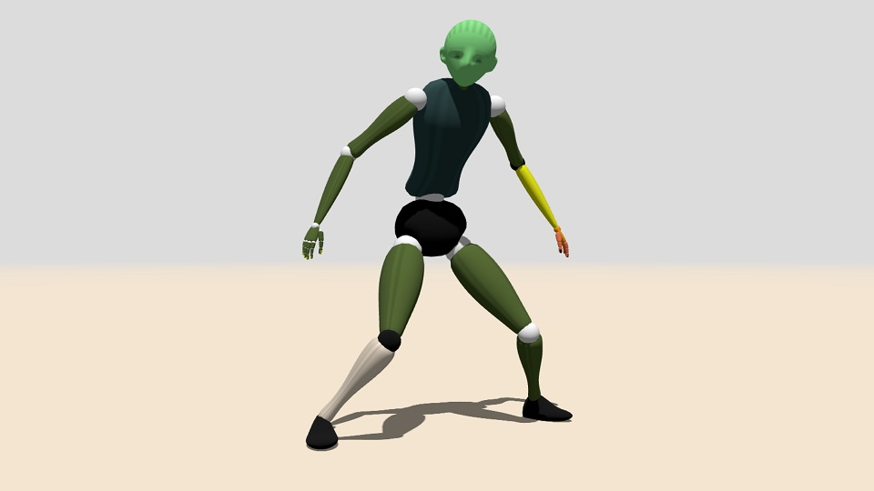](example-custom-colors.html)

``` javascript
var man = new Male();

// общи цветове
recolor( 'lightgreen', 'black', 'black', 'white',
           'darkolivegreen', 'darkslategray', 'yellow' );

:
// индивидуални цветове
man.l_elbow.recolor( 'yellow', 'black' );
man.l_wrist.recolor( 'orange' );
man.l_fingers.recolor( 'coral' );
man.r_knee.recolor( 'antiquewhite', 'black' );
man.l_nails.recolor( 'black' );
```

Първият параметър на `recolor` е цветът на основния елемент на частта от тялото.
Вторият параметър е цветът на сферичния елемент (ако има такъв).

Достъпът до върховете на пръстите се осъществява чрез `l_fingers.tips` и `r_fingers.tips`.


### Модификация на тяло

Всяка част от тялото може да бъде скрита. Това не
премахва нея и нейния графичен образ от фигурата, а
просто не я рисува. Методът за скриване е:

``` javascript
figure.joint.hide();
figure.joint.hide( true );
```

където *joint* е името на частта от тялото, която
да се скрие. Скритите части на тялото могат да се
въртят и това се отразява на частите на тялото,
прикрепени към тях. Следващият пример скрива двете
ръце и двата крака, но те все още същестуват и се
използват от лактите и коленете ([пример на живо](example-hide.html)):

[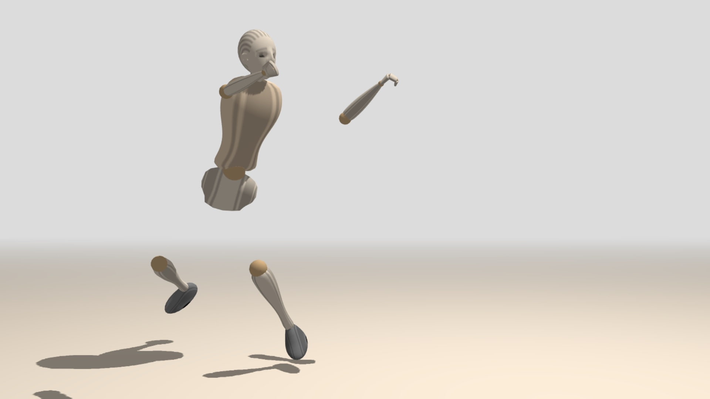](example-hide.html)

``` javascript
man.l_leg.hide();
man.r_leg.hide();
man.l_arm.hide();
man.r_arm.hide();
```

Ако `hide` се използва с параметър `true`, тогава скриването
се прилага както а съответната част на тялото, така и на
всички подчинени части.

Показването на скрита част на тяло става с:

``` javascript
figure.joint.show();
figure.joint.show( true );
```

Частите на тялото са наследници на класа [`THREE.Object3D`](https://threejs.org/docs/#api/en/core/Object3D) и поддържат
неговите свойства и методи. Въпреки това, поради конструкцията
на скелета и свързването на ставите, мащабирането на част от
тялото трябва да е еднакво по всички оси, в противен случай
позате трябва да бъде ръчно коригирана ([пример на живо](example-custom-sizes.html)):

[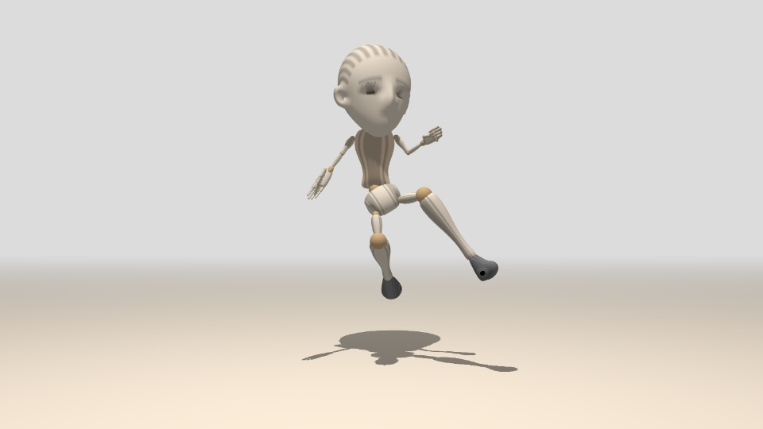](example-custom-sizes.html)

``` javascript
var man = new Male();

man.head.scale.set(3,3,3);

man.l_arm.scale.set(1/2,1/2,1/2);
man.r_arm.scale.set(1/2,1/2,1/2);

man.l_wrist.scale.set(3,5,3);
man.r_wrist.scale.set(3,5,3);
```

Всеки `THREE.Object3D` или негов наследник може да
бъде прикрепен към част от тялото. Прикрепеният
обект е включен в тялото и прави всяко движение,
което тялото извършва:

``` javascript
figure.joint.attach(object);
```

Обектите могат да бъдат прикрепени към скрити части
на тялото, но те не се скриват автоматично. Този
подход се използва за замяна на част от тялото с
изцяло собствен потребителски обект ([пример на живо](example-custom-body-parts.html)):

[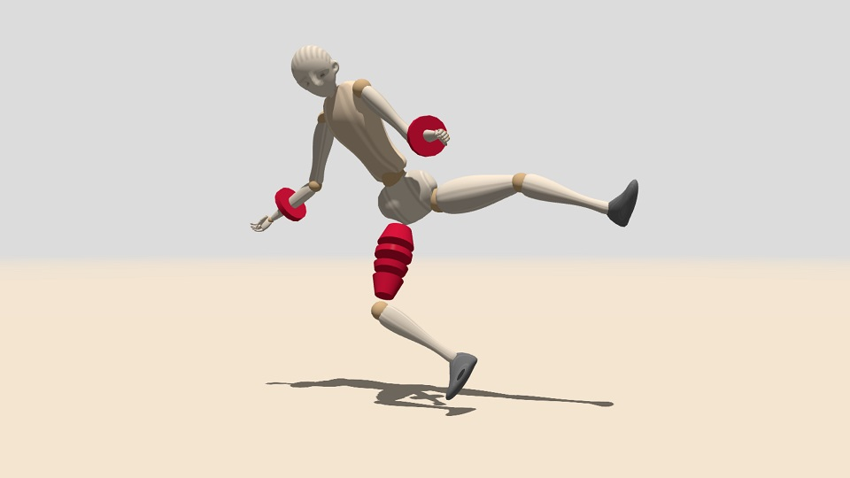](example-custom-body-parts.html)

``` javascript
var man = new Male();

// добавяне на гривни
var bracelet = new THREE.Mesh(
    new THREE.CylinderGeometry(3,3,1,16),	
    new THREE.MeshPhongMaterial({color:'crimson',shininess:200})
);
bracelet.castShadow = true;
bracelet.position.y = 6;
man.l_elbow.attach(bracelet);

bracelet = bracelet.clone();
man.r_elbow.attach(bracelet);


// замяна на крака с други обекти
man.r_leg.hide();

var material = new THREE.MeshPhongMaterial({color:'crimson',shininess:200});

var obj = new THREE.Mesh(new THREE.CylinderGeometry(3,2,3,32), material);
obj.castShadow = true;
obj.position.y = 2;
man.r_leg.attach(obj);
```

### Глобална позиция

Не всяко взаимодействие на фигури с други обекти може
да се осъществи чрез прикачване. Mannequin.js предоставя
метод `point(x,y,z)` за всяка част от тялото. Този метод
прилага [права кинематика](https://en.wikipedia.org/wiki/Forward_kinematics) и изчислява глобалните координати на точката *(x,y,z)*,
дефинирана в локалната координатна система на частта
от тялото.

Следващият пример създава въже, преминаващо през 5 точки
от частите на тялото на фигура ([пример на живо](example-point.html)):

[](example-point.html)

``` javascript
setLoopVertex( 0, man.r_fingers.tips.point(0,1,0) );
setLoopVertex( 1, man.head.point(3,1.2,0) );
setLoopVertex( 2, man.l_fingers.tips.point(0,1,0) );
setLoopVertex( 3, man.l_ankle.point(6,2,0) );
setLoopVertex( 4, man.r_ankle.point(6,2,0) );
```

Глобалните позиции могат да се използват за поставяне
на фигури към земята. Въпреки това, mannequin.js не съдържа
никаква функционалност за докосване, така че потребителят
трябва да избере точки на контакт и да използва
техните глобални позиции.

Следващият пример използва четири контактни точки на лявата
обувка (т.е. `man.l_ankle`). Контактните точки са показани
като червени точки. Минималното вертикално положение на 
контактни точки се използва за регулиране на вертикалното
положение на фигурата ([пример на живо](example-touch-ground.html)):

[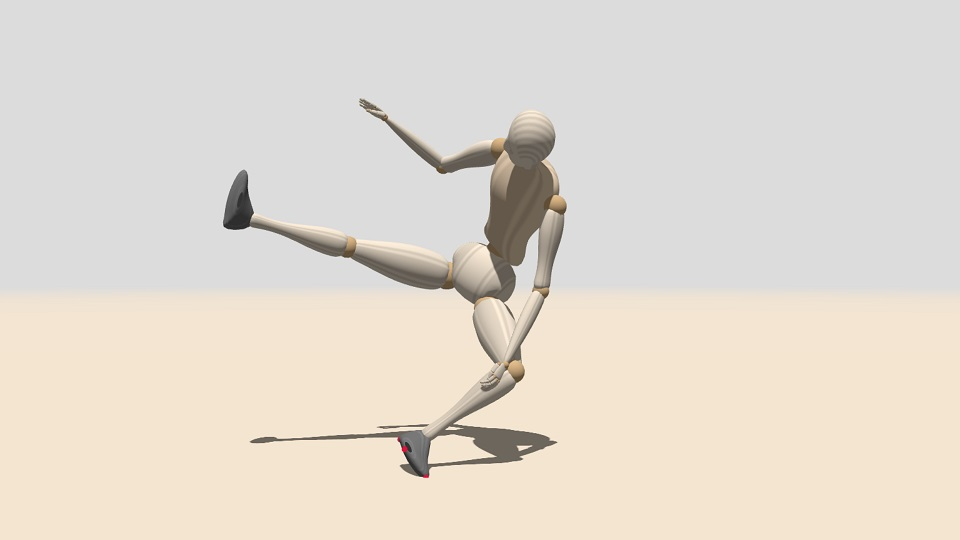](example-touch-ground.html)

``` javascript
// изчисляване на минималното вертикално отклонение на контактните точки
var bottom = Math.min(
    man.l_ankle.point(6,2,0).y,
    man.l_ankle.point(-2,2.5,0).y,
    man.l_ankle.point(2,2.5,2).y,
    man.l_ankle.point(2,2.5,-2).y,

    man.r_ankle.point(6,2,0).y,
    man.r_ankle.point(-2,2.5,0).y,
    man.r_ankle.point(2,2.5,2).y,
    man.r_ankle.point(2,2.5,-2).y
);

man.position.y += (GROUND_LEVEL-bottom);
```			

Стойността на `GROUND_LEVEL` е дефинирана от mannequin.js при използването на
`createScene()`. Съдържа вертикалното отместване на нивото на земята.

Фигура може да използва функцията  `stepOnGround()`, за да се придвижи вертикалнно,
така че най-ниската ѝ точка да докосва земята.

``` javascript
man.stepOnGround();
```	


# Използване на mannequin.js

Библиотеката mannequin.js се предоставя като комплект от JavaScript модули.
Предназначена е да се използва от CDN. Най-вероятно библиотеката може да бъде
инсталирана с `npm`, но това не е пробвано все още.

Библиотеката използва Three.js и очаква следните importmaps да бъдат дефинирани:

* `three`: указател към Three.js файла `three.module.js` 
* `three/addons/`: указател към пътя на добавките на Three.js
* `mannequin`: указател към главния файл на библиотеката `mannequin.js`

Следващите подсекции демонстраират някои от конфигурационните сценарии на
използване на mannequin.js.


### Пускане от CDN

Съкращението CDN означава [Content Delivery Network (Мрежа за доставка на съдържание)](https://bg.wikipedia.org/wiki/Мрежа_за_доставка_на_съдържание).

Относно mannequin.js CDN служи като хостинг на библиотечните файлове. Към
момента на изготвяне на този докумен се препоръчва ползването на [jsDelivr](https://cdn.jsdelivr.net).
Други CDN също са възможни.
 
Основните предимства на използването на CDN са:
* няма нужда от инсталиране на mannequin.js
* няма нужда от инсталиране на nodes.js или друг мениджър на JS модули
* няма нужда от инсталиране на локален уеб сървър
* потребителски файл може да се стартира директно в браузър

Основните недостатъци на използването на CDN са:
* изисква се интернет достъпът до CDN при стартиране на програмата
* указателите към Three.js и mannequin.js трябва да бъдат дефинирани като importmaps

Донякъде минимална програма, която използва mannequin.js от този CDN, е показана
в този [пример на живо](example-minimal-cdn.html). Ако файлът е свален локално, той
може да се стартира директно без допълнителна инсталация. Указателите в importmaps в
примера сочат към конкретна версия на Three.js и към най-новата версия на mannequin.js.


```html
<!DOCTYPE html>

<html>

<head>
   <script type="importmap">
   {
      "imports": {
         "three": "https://cdn.jsdelivr.net/npm/three@0.170.0/build/three.module.js",
         "three/addons/": "https://cdn.jsdelivr.net/npm/three@0.170.0/examples/jsm/",
         "mannequin": "https://cdn.jsdelivr.net/npm/mannequin-js@latest/src/mannequin.js"
      }
   }
   </script>
</head>

<body>
   <script type="module">
      import { createStage, Male } from "mannequin";
      createStage( );
      new Male();
   </script>
</body>
</html>
```

Много от примерите в този документ използват скрипта `importmap.js`
за генериране на importmaps  и инжектирането им в страницата. Това се прави единствено
за поддържане на по-кратък код и за лесно превключване към други версии както на
Three.js, така и на mannequin.js.


### Пускане през локален уеб сървър

По същество пускането е същото като от CDN, като вместо CDN се ползва локална папка.
Единствената промяната са пътищата в importmaps, които сочат към локалните
файлове и папки.

Основните предимства на използването на локални файлове са:

* не е необходим достъп до интернет
* няма нужда от инсталиране на nodes.js или друг мениджър на JS модули
* защитеност от евентуална несъвместима промяна в онлайн библиотеките
* потребителски файл може да се стартира директно в браузър
* потребителски код може да използва модули и може да бъде разделен на няколко файла

Основните недостатъци на използването на локални файлове са:

* mannequin.js и всички негови изходни файлове трябва да бъдат свалени
* трябва да бъде инсталиран локален уеб сървър
* указателите към локалните Three.js и mannequin.js все пак трябва да са дефинирани в importmaps

Възможно е едновременното използване на CDN и на локални файлове. Например,
използва се онлайн Three.js от CDN и локалнен mannequin.js. Това се определя от
пътищата в importmaps.

### Пускане през nodes.js

Библиотеката mannequin.js се предоставя като NPM пакет. Ако nodes.js е инсталиран
на потребителското устройство, трябва да е възможно да се инсталира mannequin.js
и да се използва директно.

Основните предимства на използването на nodes.js:

* не е необходим достъп до интернет, освен за самата инсталация на пакета
* няма нужда да се ползват importmaps (целият таг за importmaps се спестява)
* защитеност от евентуална несъвместима промяна в онлайн библиотеките

Основните недостатъци на използването на nodes.js:
* nodes.js трябва да бъде инсталиран
* mannequin.js трябва да бъде инсталиран

Забележка: Този подход не е тестван. Ако установите, че не работи, но знаете
какво трябва да се коригира, за да проработи, моля, свържете се с нас.


### АПИ

Библиотеката mannequin.js дефинира следните фукции и класове:

* `createStage(animationLoop)` &ndash; функция, създава сцена със земя и светлини
* `getStage()` &ndash; функция, текущата сцена*
* `getVersion()` &ndash; функция, текущата версия на mannequin.js като число; напр. 5.2
* `getPostureVersion()` &ndash; функция, текущата версия на формата на данните, описващи поза
* `getGroundLevel()` &ndash; функция, вертикалното положение на земята в метри
* `blend(p,q,k)` &ndash; функция, смесена поза на пози *p* и *q* с коефициент *k*
* `Mannequin(feminine,height)` &ndash; клас, най-обща фигура
* `Male(height)` &ndash; клас, мъжка фигура
* `Female(height)` &ndash; клас, женска фигура
* `Child(height)` &ndash; клас, детска фигура

Всички фигури (инстанции на `Mannequin`, `Male`, `Female` и `Child`) имат еднакъв
набор от свойства и методи.

* `body`, `pelvis`, `torso`, `neck`, `head` &ndash; свойства, основни части на тяло
* `l_leg`, `l_knee`, `l_ankle` &ndash; свойства, части на ляв крак
* `r_leg`, `r_knee`, `r_ankle` &ndash; свойства, части на десен крак
* `l_arm`, `l_elbow`, `l_wrist`, `l_finger_0`...`l_finger_4`, `l_fingers`, `l_nails` &ndash; свойства, части на лява ръка
* `r_arm`, `r_elbow`, `r_wrist`, `r_finger_0`...`r_finger_4`, `r_fingers`, `r_nails` &ndash; свойства, части на дясна ръка
* `feminine` &ndash; свойство, булев флаг дали фигура е женска
* `bend`, `tilt`, `turn` &ndash; свойства, завъртяност на тяло
* `posture`, `postureString` &ndash; свойства, поза на фигура
* `stepOnGround()` &ndash; метод, премества вертикално фигура, за да докосне земята
* `recolor(...)` &ndash; метод, променя цветовете на частите на тяло

Всички части на тяло имат подобни свойства и методи. Някои от свойствата за завъртане
не са налични за всички части поради биологически причини.

* `posture` &ndash; свойство, поза на част на тяло (масив от ъглите на завъртане)
* `hide()`, `show()` &ndash; методи, скриване и показване на част от тяло
* `attach(image)`, `detach(image)` &ndash; методи, добавяне и премахване на потребителски 3D обект ктм част на тяло
* `point(x,y,z)` &ndash; метод, изчисляване на глобални координати на локална позиция (x,y,z) спрямо част на тяло
* `recolor(...)` &ndash; метод, смяна на цветовете на част на тяло
* `label(...)` &ndash; метод, добавяне на 3D текст към част на тяло
* `bend`, `tilt`, `turn` &ndash; свойства, завъртяност на глезени, тяло, торс и китки
* `bend` &ndash; свойство, завъртяност на лакти и колена
* `bend`, `straddle`, `turn` &ndash; свойства, завъртяност на пръсти
* `raise`, `straddle`, `turn` &ndash; свойства, завъртяност на ръце и крака
* `nod`, `tilt`, `turn` &ndash; свойства, завъртяност на глава

Пръстите имат допълителни свойства и методи за достъп до тяхната структура:

* `mid` &ndash; свойство, средна фаланга на пръст
* `mid.bend` &ndash; метод, завъртяност на средната фаланга
* `tip` &ndash; свойство, крайна фаланга на пръст
* `tip.nail` &ndash; свойство, нокът на пръст
* `tip.bend` &ndash; метод, завъртяност на крайната фаланга
* `tip.nail.bend` &ndash; метод, завъртяност на нокът ... шегувам се, няма такъв метод
	
Груповите свойства `l_fingers` и `r_fingers` съдържат:
* `finger_0`...`finger_4` &ndash; свойства, отделните пръсти, съответстващи на `l_finger_0`...`l_finger_4` и `r_finger_0`...`r_finger_4`
* `bend` &ndash; метод, свиване на всички пръсти, включително средните и крайните фаланги
* `hide()`, `show()` &ndash; методи, скриване и показване на всички пръсти
		
		
		
		
<div class="footnote">
	<a href="../">Home</a> &middot;
	<a href="https://github.com/boytchev/mannequin.js">GitHub</a> &middot; 
	<a href="https://www.npmjs.com/package/mannequin-js">NPM</a>
</div>